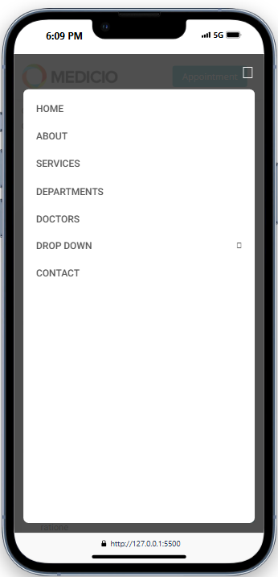

<h1 align="center">🩺🏥Medicio</h1>

- This project is a front end of hospital management.
- Building this Web app with intention of learning HTML/CSS and JavaSCript better.

## 📸 screenshot

<h1 align = "center">Desktop view</h1>
<table border="1">
  <thead>
    <tr>
      <th style="text-align:center;" >Home</th>
    </tr>
  </thead>
  <tbody>
    <tr>
      <td></img></td>
    </tr>
  </tbody>
</table>
<table border="1">
<thead>
    <tr>
      <th style="text-align:center;" >2</th>
      <th style="text-align:center;" >3</th>
    </tr>
  </thead>
  <tbody>
    <tr>
      <td></img></td>
      <td></img></td>
    </tr>
  </tbody>
  <thead>
    <tr>
      <th style="text-align:center;" >4</th>
      <th style="text-align:center;" >5</th>
    </tr>
  </thead>
  <tbody>
    <tr>
      <td></img></td>
      <td></img></td>
    </tr>
  </tbody>
</table>
<h1 align = "center">Mobile view</h1>
<table border="1">
<thead>
    <tr>
      <th style="text-align:center;" >1</th>
      <th style="text-align:center;" >2</th>
    </tr>
  </thead>
  <tbody>
    <tr>
      <td></img></td>
      <td></img></td>
    </tr>
  </tbody>
  <thead>
    <tr>
      <th style="text-align:center;" >3</th>
      <th style="text-align:center;" >4</th>
    </tr>
  </thead>
  <tbody>
    <tr>
      <td></img></td>
      <td></img></td>
    </tr>
  </tbody>
</table>

## 📜 License

```
©️2025

This project is licensed under the MIT License.
```